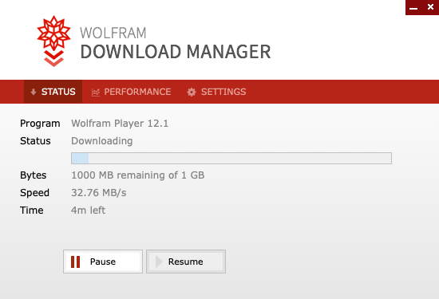
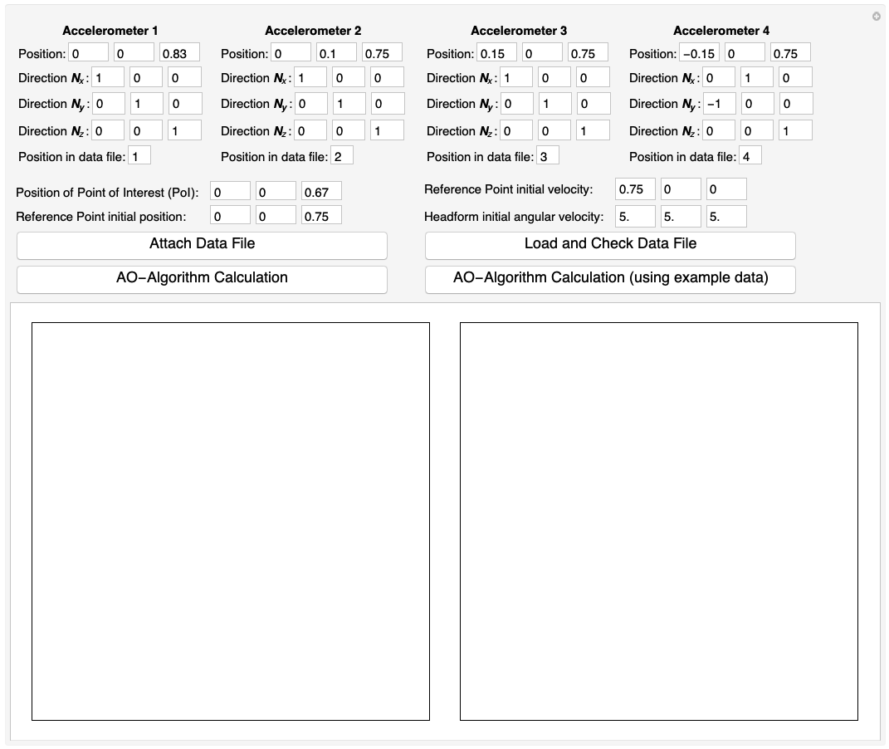
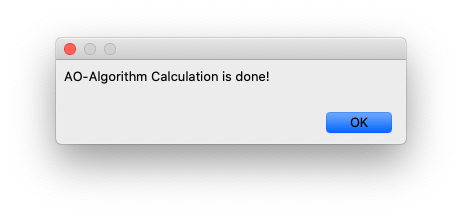

# AO-Desktop-App

Determining the motion and acceleration field of a rigid body using measurements from four tri-axial accelerometers.

<!-- TABLE OF CONTENTS -->

  
Table of Contents

  <ol>
    <li>
      <a href="#screenshot">Screenshot</a>
    </li>
    <li>
      <a href="#getting-started">Getting Started</a>
      <ul>
        <li><a href="#download-and-install-wolfram-player">Download and Install Wolfram Player</a></li>
        <li><a href="#download-ao-desktop-app">Download AO-Desktop-App</a></li>
        <li><a href="#usage-example">Usage Example</a></li>
      </ul>
    </li>
    <li>
      <a href="#requirement-on-input-fields-and-data-files">Requirement on Input Fields and Data Files</a>
      <ul>
        <li><a href="#positions-and-directions-of-four-accelerometers">Positions and Directions of Four Accelerometers</a></li>
        <li><a href="#accelerometer-data-file-format">Accelerometer Data File Format</a></li>
        <li><a href="#point-of-interest-(poi)-and-initial-conditions">Point of Interest (PoI) and Initial Conditions</a></li>
      </ul>
    </li>
    <li><a href="#license">License</a></li>
    <li><a href="#contact">Contact</a></li>
    <li><a href="#reference">Reference</a></li>
  </ol>

## Screenshot

This app is developed using Wolfram Language. It takes positions, directions and measurements of 4 accelerometers, position of point of interest and initial conditions of a rigid body as input. After performing calculation using AO-Algorithm, it outputs an interactive plot of multiple choices of variables and a simulation video showing the motion of the rigid body.

## Getting Started
It is easy to run AO-Desktop-App on your own by following the instructions:

### Download and Install Wolfram Player
In order to open the AO-Desktop-App in the main file `AO-App.cdf`, you need to install [Wolfram Player](https://www.wolfram.com/player/) on your computer. [Wolfram Player](https://www.wolfram.com/player/) is a free software developed by [Wolfram Reserch](https://en.wikipedia.org/wiki/Wolfram_Research). The player is available for Microsoft Windows, Macintosh, Linux and iOS, and can be downloaded from the following website:

https://www.wolfram.com/player

Taking **MacOS** for example, after you open the downloaded `WolframPlayer_12.1.1_MAC_DLM` file, you should be able to see

After it is finished, you need to launch the installation package and it will show

When this is done, you can drag the Wolfram Player icon to the Applications folder to complete installation.

### Download AO-Desktop-App

On the top-right corner of this page, you will see a green button **⤓ Code**. Clicking on it, you will find the option to **Download ZIP** of the whole project.

You need to unzip the file. Inside the resulted folder, you will find the main file `AO-App.cdf`, open it with [Wolfram Player](https://www.wolfram.com/player/). Upon opening the file, you may see a pop-up window as shown in the following screenshot. Click on **Yes**.

### Usage Example

After you have done all the above steps correctly, A user-interface will show up in the opened file as the following screenshot.

You will need to input data including positions and directions of four accelerometers in global coordinate system, attach data files and input position of Point of Interest (PoI) and initial conditions in order to hit on **AO-Algorithm Calculation** button. We will discuss the requirement of each input field and the format of data files in next section.

For a quick demonstration, you can simply click **AO-Algorithm Calculation (using example data)** button to load example data and run the calculation. It takes around 20 seconds, depending on your CPU and memory performance, to finish the calculation. When it is finished, you will see a dialog window shown as

After clicking **OK**, the result will show up in the output panel. You can choose different output plots and control the video interactively.

## Requirement on Input Fields and Data Files

### Positions and Directions of Four Accelerometers
Type positions and directions components as real numbers in the input boxes. Be aware that positions and directions vectors are projected in global coordinate system. For the given example data, we have
* **Accelerometer 1**
  - Position: $(0,0,0.83)$
  - $\boldsymbol{N}_x = (1, 0, 0)$, $\boldsymbol{N}_y = (0, 1, 0)$, $\boldsymbol{N}_z = (0, 0, 1)$
* **Accelerometer 2**
  - Position: $(0,0.1,0.75)$
  - $\boldsymbol{N}_x = (1, 0, 0)$, $\boldsymbol{N}_y = (0, 1, 0)$, $\boldsymbol{N}_z = (0, 0, 1)$
* **Accelerometer 3**
  - Position: $(0.15,0,0.75)$
  - $\boldsymbol{N}_x = (1, 0, 0)$, $\boldsymbol{N}_y = (0, 1, 0)$, $\boldsymbol{N}_z = (0, 0, 1)$
* **Accelerometer 4**
  - Position: $(-0.15,0,0.75)$
  - $\boldsymbol{N}_x = (0, 1, 0)$, $\boldsymbol{N}_y = (-1, 0, 0)$, $\boldsymbol{N}_z = (0, 0, 1)$

### Accelerometer Data File Format

* Each data file only contains the acceleration measurement of a single accelerometer.
* All measurements should have same frequency, starting from the same time instance $t = 0.0 $ and ending at same time instance.
* Each data file should contain 4 columns. From left to right, the 4 columns denote time, acceleration in $X$ direction, acceleration in $Y$ direction, acceleration in $Z$ direction.
* The first row should be the labels for each column. Starting from the second row, measurement are separated by either space or comma.
* Use SI units (Meter, Second, Kg, etc.) for all data.

An example format of acceptable data file is
| Time | Acc_X | Acc_Y | Acc_Z |
|------|-------|-------|-------|
| 0.0 | 3.46  | -5.  |  -7.85 |
| 0.00025  | 3.48  | -5.01   | -7.85   |
| ...   | ...   | ...   | ...   |

### Point of Interest (PoI) and Initial Conditions
* You need to choose a Point of Interest (PoI) and input its position so that the app will predict the **Acceleration**, **Velocity** and **Position** of PoI as functions of time.
  * We take the Point of Interest to be $(0, 0, 0.67)$ in the example data.
* A reference point is required in order to define initial position and initial velocity. The reference point can be any point whose position and velocity are known in the initial time instance. It is not necessary to be the center of mass, or one of the accelerometer positions.
  * We take the reference point initial position to be $(0,0,0.75)$ and reference point initial velocity to be $(0.75,0,0)$ in the example data.
* The initial angular velocity of the Headform should be given.
  * We take the initial angular velocity to be $(5,5,5)$ in the example data.

## License
Distributed under the GNU General Public License. See `LICENSE` for more information.
## Contact
Wenqiang Fang - wenqiang_fang@brown.edu
Project Link: https://github.com/AppliedMechanicsLab/AO-Desktop-App
## Reference
Rahaman, Mohammad Masiur, Wenqiang Fang, Alice Lux Fawzi, Yang Wan, and Haneesh Kesari. "An accelerometer-only algorithm for determining the acceleration field of a rigid body, with application in studying the mechanics of mild Traumatic Brain Injury." *Journal of the Mechanics and Physics of Solids* (2020): 104014.
